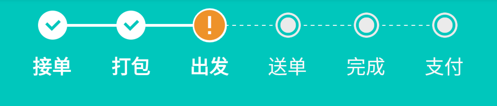
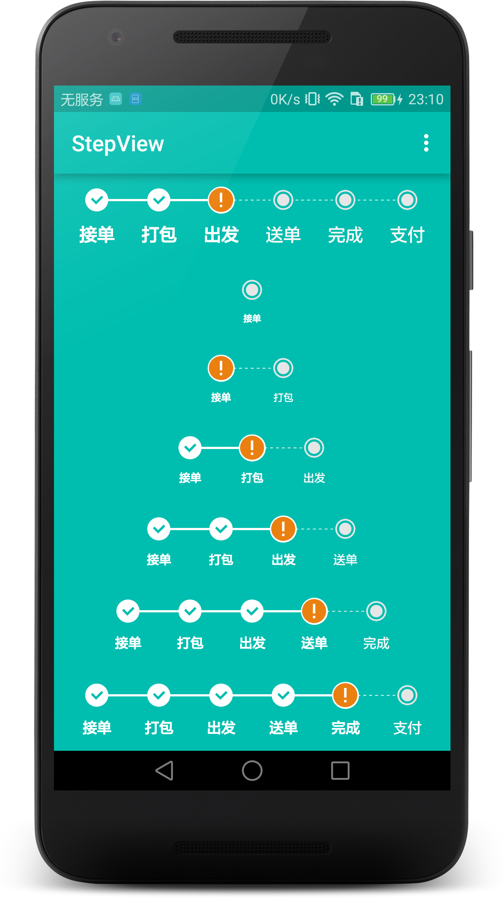
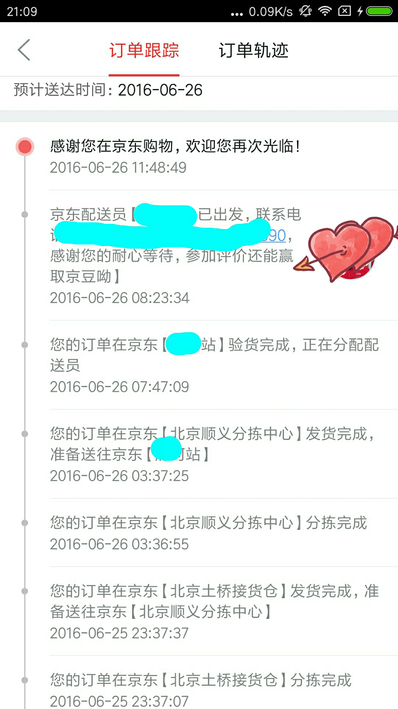
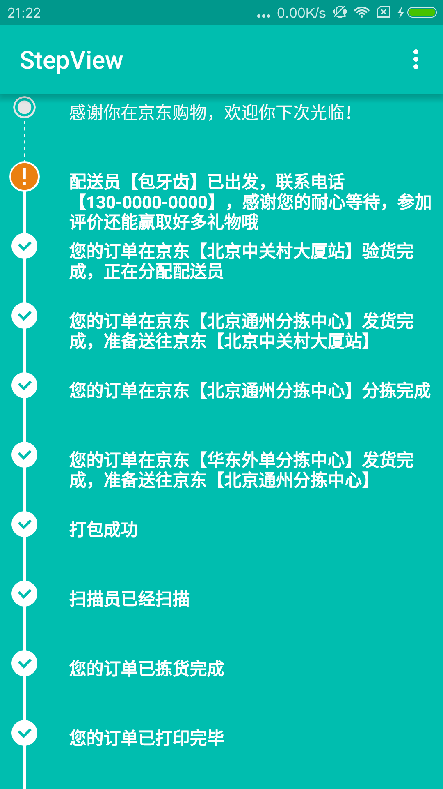

# StepView [](https://jitpack.io/#baoyachi/StepView)
Step by step. Step indicator. Flow indicator。  


</img>

## snapshot
#### like this:HorizontalStepView
</img>

#### like this 
</img>

#### also like this:VerticalStepView
</img>

Yeah，I am not working in JD，Just imitate.It's a joke .ha ha ha 


It is looks like so beautiful.


## how to use

Add it in your root build.gradle at the end of repositories:

	repositories {
			...
			maven { url "https://jitpack.io" }
		}
Step 2. Add the dependency

	dependencies {
	        compile 'com.github.baoyachi:StepView:1.9'
	}		


### use HorizontalStepView

in xml

```java
	<com.baoyachi.stepview.HorizontalStepView
            android:id="@+id/step_view"
            android:layout_width="match_parent"
            android:layout_height="wrap_content"
            android:layout_centerInParent="true"
            />
```
use code

```java
HorizontalStepView setpview5 = (HorizontalStepView) mView.findViewById(R.id.step_view5);
        List<StepBean> stepsBeanList = new ArrayList<>();
        StepBean stepBean0 = new StepBean("接单",1);
        StepBean stepBean1 = new StepBean("打包",1);
        StepBean stepBean2 = new StepBean("出发",1);
        StepBean stepBean3 = new StepBean("送单",0);
        StepBean stepBean4 = new StepBean("完成",-1);
        stepsBeanList.add(stepBean0);
        stepsBeanList.add(stepBean1);
        stepsBeanList.add(stepBean2);
        stepsBeanList.add(stepBean3);
        stepsBeanList.add(stepBean4);


        setpview5
                .setStepViewTexts(stepsBeanList)//总步骤
                .setTextSize(12)//set textSize
                .setStepsViewIndicatorCompletedLineColor(ContextCompat.getColor(getActivity(), android.R.color.white))//设置StepsViewIndicator完成线的颜色
                .setStepsViewIndicatorUnCompletedLineColor(ContextCompat.getColor(getActivity(), R.color.uncompleted_text_color))//设置StepsViewIndicator未完成线的颜色
                .setStepViewComplectedTextColor(ContextCompat.getColor(getActivity(), android.R.color.white))//设置StepsView text完成线的颜色
                .setStepViewUnComplectedTextColor(ContextCompat.getColor(getActivity(), R.color.uncompleted_text_color))//设置StepsView text未完成线的颜色
                .setStepsViewIndicatorCompleteIcon(ContextCompat.getDrawable(getActivity(), R.drawable.complted))//设置StepsViewIndicator CompleteIcon
                .setStepsViewIndicatorDefaultIcon(ContextCompat.getDrawable(getActivity(), R.drawable.default_icon))//设置StepsViewIndicator DefaultIcon
                .setStepsViewIndicatorAttentionIcon(ContextCompat.getDrawable(getActivity(), R.drawable.attention));//设置StepsViewIndicator AttentionIcon
```
### use VerticalStepView
this widget can reverse or forward draw,please look at below jd express picture 

</img>

this status is reverse draw,so ,wo also have a method can realize jd express effect
like this:
</img>

```javass
	/**
     * is reverse draw 是否倒序画
     * 
     * @param isReverSe default is true
     * @return
     */
    public VerticalStepView reverseDraw(boolean isReverSe)
    {
        this.mStepsViewIndicator.reverseDraw(isReverSe);
        return this;
    }
```
you can use this method can realize reverse draw;Also you can see exmaple[MainActivity](https://github.com/baoyachi/StepView/blob/master/app/src/main/java/com/baoyachi/stepview/demo/MainActivity.java),this example has detail useful description;


in xml

```java
	<com.baoyachi.stepview.VerticalStepView
            android:id="@+id/step_view0"
            android:layout_width="wrap_content"
            android:layout_height="match_parent"
            />
```
in code

```java

mSetpview0 = (VerticalStepView) findViewById(R.id.step_view0);

        List<String> list0 = new ArrayList<>();
        list0.add("接已提交定案，等待系统确认");
        list0.add("您的商品需要从外地调拨，我们会尽快处理，请耐心等待");
        list0.add("您的订单已经进入亚洲第一仓储中心1号库准备出库");
        list0.add("您的订单预计6月23日送达您的手中，618期间促销火爆，可能影响送货时间，请您谅解，我们会第一时间送到您的手中");
        list0.add("您的订单已打印完毕");
        list0.add("您的订单已拣货完成");
        list0.add("扫描员已经扫描");
        list0.add("打包成功");
        list0.add("配送员【包牙齿】已出发，联系电话【130-0000-0000】，感谢您的耐心等待，参加评价还能赢取好多礼物哦");
        list0.add("感谢你在京东购物，欢迎你下次光临！");
        mSetpview0.setStepsViewIndicatorComplectingPosition(list0.size() - 2)//设置完成的步数
		         .reverseDraw(false)//default is true
                .setStepViewTexts(list0)//总步骤
                .setLinePaddingProportion(0.85f)//设置indicator线与线间距的比例系数
                .setStepsViewIndicatorCompletedLineColor(ContextCompat.getColor(getActivity(), android.R.color.white))//设置StepsViewIndicator完成线的颜色
                .setStepsViewIndicatorUnCompletedLineColor(ContextCompat.getColor(getActivity(), R.color.uncompleted_text_color))//设置StepsViewIndicator未完成线的颜色
                .setStepViewComplectedTextColor(ContextCompat.getColor(getActivity(), android.R.color.white))//设置StepsView text完成线的颜色
                .setStepViewUnComplectedTextColor(ContextCompat.getColor(getActivity(), R.color.uncompleted_text_color))//设置StepsView text未完成线的颜色
                .setStepsViewIndicatorCompleteIcon(ContextCompat.getDrawable(getActivity(), R.drawable.complted))//设置StepsViewIndicator CompleteIcon
                .setStepsViewIndicatorDefaultIcon(ContextCompat.getDrawable(getActivity(), R.drawable.default_icon))//设置StepsViewIndicator DefaultIcon
                .setStepsViewIndicatorAttentionIcon(ContextCompat.getDrawable(getActivity(), R.drawable.attention));//设置StepsViewIndicator AttentionIcon
```

Use So Simple!!!

## See Detail

> [详细链接请点击](Introduction.md)


### 参考链接
[Android-StepsView](https://github.com/anton46/Android-StepsView)

## Thanks
* 感谢 [iconfont](http://iconfont.cn/) 提供的图片资源
* 感谢 [anton46](https://github.com/anton46/) 提供的源码作参考

### 图片来源
* [step](http://iconfont.cn/search?q=step)
* [complted](http://iconfont.cn/search?q=right)
* [attention](http://iconfont.cn/search?q=attention)
* [default-icon](http://iconfont.cn/search?q=default)

## End
喜欢这个控件的小伙伴可以点击star哦！

## Contact us
* 【简书】[包牙齿](http://www.jianshu.com/users/7096f185d063/)

* 【微博】[包牙齿](http://weibo.com/baoyachi)
